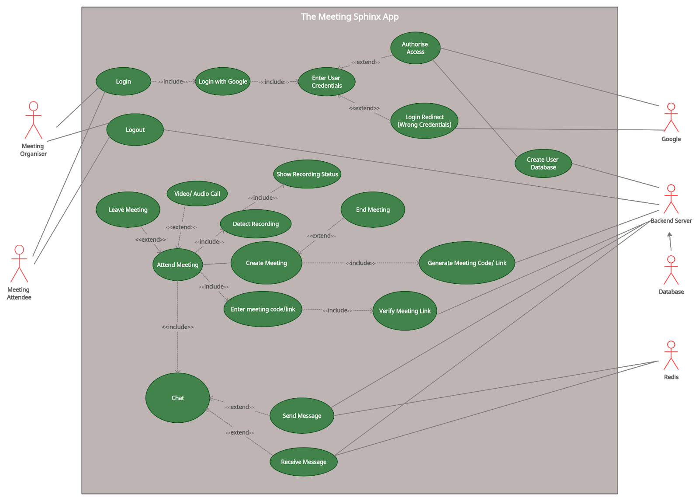
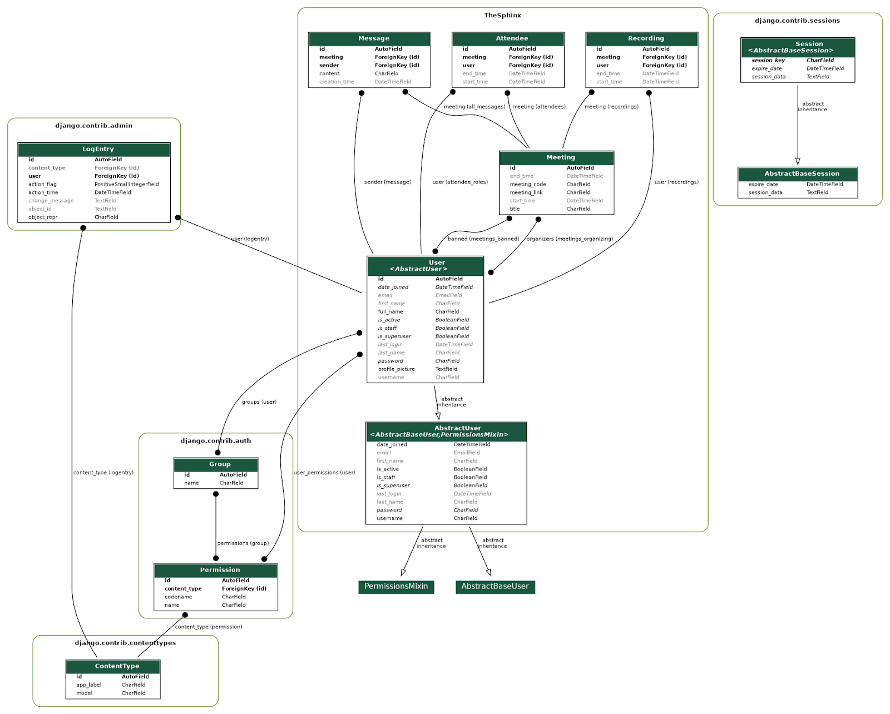
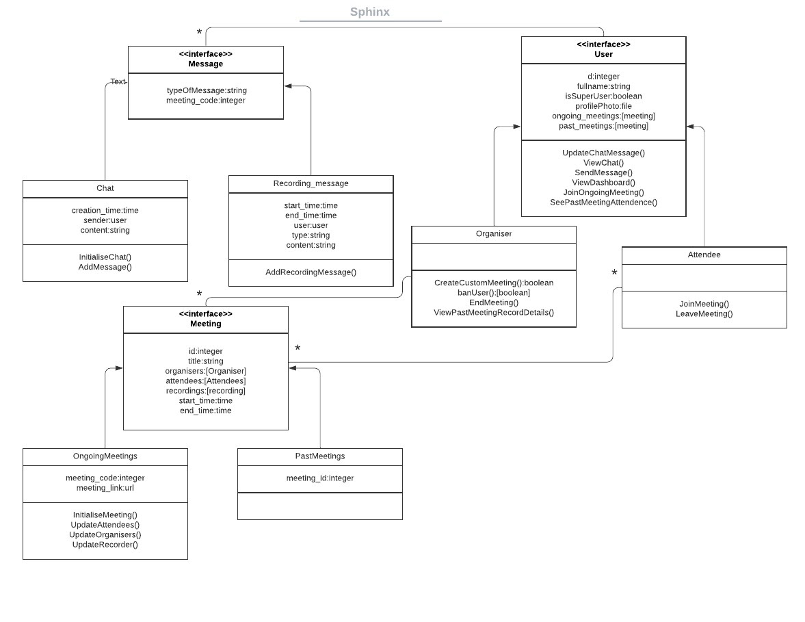
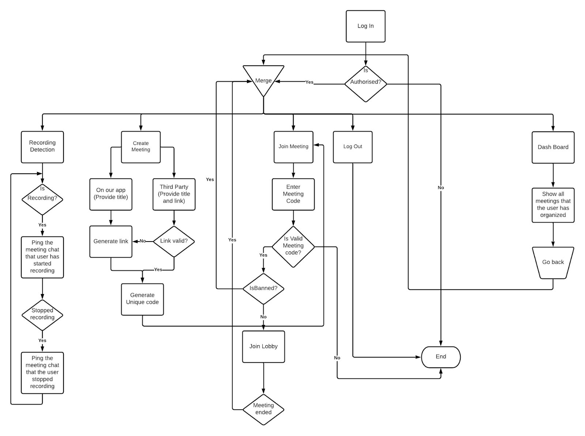
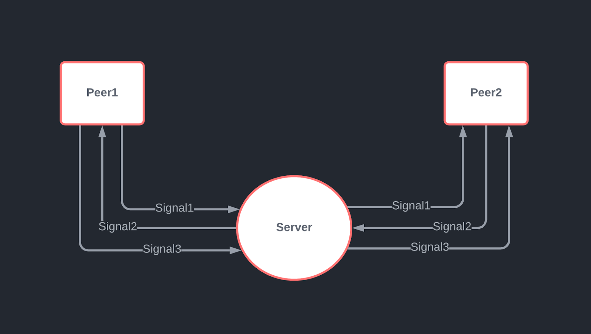

---
title: Design Doculment
layout: default
filename: design-doc.md
--- 

 [Home Page](index) [Design Document](design-doc)

## Summary

With the ever-increasing pandemic situation that we are experiencing these days, nearly every activity has undergone digitization. Major activities that were held physically are now being held in online platforms such as conferences, classes and a lot more. Thus, online meetings have become a very important part of our life these days. But, at the same time it comes at the cost of privacy, thus ensuring privacy of users is one of the major concerns.

Our app, *The Meeting Sphinx* is a platform to conduct *secure* meetings ensuring the privacy of anyone who wishes to conduct an online meeting.

In a normal meeting, the users have no way to know if anyone recorded their meeting without their knowledge. Sometimes, people may state some things casually, with a good motive, that might be used against them in a harmful manner. Thus, an app that detects such uninformed meeting recordings by its users can help solve this major problem and prevent such breach of privacy of the speaker.

The Meeting Sphinx is based on this very idea and can detect recording by any person who attends the meeting. It then notifies the people attending the meeting along with the details of the recording and the user who started the same. Thus, the speaker would be vigilant and their privacy is preserved.

The organiser can either use our own app to conduct meetings or can even use a third party app for meetings, in which case, our app can be used as an attendance system (mainly for conducting online classes) where the organiser would be notified of any ongoing recordings.

Thus the security of all users is established.

## High level design

## Use Case Diagram of The Meeting Sphinx

<i>Use Case Diagram</i>

### Description of use cases:

1.**Login**

  1. Mainline Sequence:
      1. User clicks on the &#39;Log in with Google&#39; Button, and is redirected to a Google webpage.
      2. User logs into his google account and approves our app to be trusted with the user&#39;s google profile information.
      3. After logging into google, the user will be redirected back to our app&#39;s home page.
  2. At step ii of Mainline Sequence
      1. Credentials entered by the user was incorrect and login fails
      2. User is redirected to the login page to re enter credentials
2.**Logout**
  1. Mainline Sequence:
      1. When a user clicks the logout button, a request is sent to the backend to log him out. Then, at the backend, his session is deleted and hence, he/she is logged out of our app.

3.**Create Meeting**
  1. Mainline sequence : App is used as a third party app 
      1. When the user creates a meeting, a random code is generated for that particular meeting and details of that meeting with its creator, description, etc. are stored in the backend.
      2. We give the user the function to upload a custom third-party meeting url into an input box. Users will be redirected to this meeting url once they enter the code generated in the first part.
  2. Mainline sequence : Meeting is held in our app platform
 (If the creator wants to use our web conferencing platform to host his / her meeting, he / she need not fill that meeting link box. )
      1. App: A custom url for the meeting will be generated and associated with the meeting automatically.
      2. Organiser: Meeting link is shared with the attendees
      3. Attendee:Enters the code for a meeting that is hosted on our platform
      4. Attendee will be redirected to our platform once his credentials are validated.
    
4.**Attend Meeting**
  1. Mainline Sequence:
      1. The attendee will use the lobby code to enter the lobby.
      2. The backend finds the room that corresponds to the entered code.
      3. If a valid meeting is found, then the user is redirected to the meeting lobby.
      4. When the meeting is running, daemons on the devices of each user check to see whether a screen is being recorded or not.
      5. The information on screen recording is relayed back to the organiser&#39;s screen.
      6. Attendees of the meeting can send messages in the meeting chat.
      7. The meeting can be ended by the organiser.
  2. Step iii of mainline sequence
      1. If a meeting is not found, the user is redirected back to the home page.

5.**Video Call ( For meetings held in our app )**

  1. Mainline Sequence:  
      1. Users will allow our software access to their camera.
      2. Users can view other attendees&#39; videos by clicking on the see attendee videos button
  2. At the ii step of Mainline Sequence:
      1. Users either don&#39;t allow access to the camera or their camera is being used by some other application.
      2. User is redirected to the home page of our app ( for our app meetings )

## Class Diagram of our Backend

<i>Class Diagram   This shows the inheritance and other relationships between the models(database) that we have made.</i>

## Class Diagram of our Frontend

<i>The class diagram of our app frontend 
You can observe the various association relationships between classes. </i>

## Flow Chart

<i>Flow chart  The Final document of our app shows the implementation of each flow and how things are working.</i>

## Low level design

The major workflows present in our app include Recording Detection and Notification, Meeting Creation and Joining, Lobby Chat, Video Conferencing (in the meetings held in our app) and User-Ban. The functionalities have been implemented as follows.

## Recording Detection and Notification

This is the main functionality of our app. A script runs in the background as soon as any user starts our app. Initially, when the user hasn&#39;t joined any meeting, he/she is put in a dummy meeting. If recording starts in this interval a flag is set in the backend and is reset every time it stops before the user leaves the dummy meeting to join a meeting with a specific code. If recording is still ongoing when the user joins (determined by the flag in backend), the user is marked red and in case the user starts recording in the middle of a meeting, then also the user is marked red. When anyone stops recording, the marked users are made normal again. People are also notified in the chat at the start and stop of recording by any user who&#39;s present in the meeting.

### Recording Detection Algorithm

- *Data structures used:*

  - *recordersDetected* : List containing the recorder processes found in user&#39;s system
  - *standardRecorders* : List containing the standard recorder processes for screen recording

- *Functions:*
  - *checkNewRecorders* : Uses npm package *ps-list*. Detects if any new recorder processes are found in the system or not and updates about start of recording.
  - *updateRecorders* : Checks if a recorder process has stopped and updates about the stopping of recording. It also uses *ps-list* to list all system processes.

- *Algorithm:*
  - The checkNewRecorders function is called continuously to check if the user has started recording or not.
  - It compares the list of system processes of the user and tries to find, if any of those match with the processes present in the standardRecorders list.
  - If found, the process is added to the list recordersDetected and a message is sent to the backend using WebSockets set up using Django Channels, else it does nothing.
  - The updateRecorders function is checked to determine if the user recording has stopped or not.
  - It compares the processes in the list with the current system processes of the user, obtained using *ps-list*. If a recorder is not found in the process list then it is removed from the recordersDetected list. If the length of the list becomes 0 at any point of time, then no recording is going on in the system, thus, it messages the backend using the WebSocket set up for the same about recording stop.

### Recording Notification

Once the recording has been detected or when it has been stopped, the people present in the meeting are to be notified.

- First, the backend is to be notified about the user and the meeting details. The script has a function *obtainCookies* that gets the details about the meeting such as the meeting\_code from the cookies set in the browser and joins the lobby for the same meeting using the obtained information.
- Once a recording has been detected, a message named &quot;user\_recrd\_start&quot; is sent in the socket. The backend then resolves this request and notifies the frontend again using the meeting socket using the same message to the frontend.

After this, the user that was recording is marked in red and the message regarding the recording is also shown in the lobby chat.

- Similarly, on recording being stopped, the script sends a message named &quot;user\_recrd\_stop&quot; to the backend which handles the message in a similar manner as the frontend.

## Meeting Creation and Joining

When a new user logs into our app. He/She would have two options -- Create an New Meeting or Join a Meeting

### Create New Meeting

- The user enters the name of the meeting
- The user is asked to provide either a custom meeting link, or can create a meeting in our app
- If a user enters a custom meeting link, he/she is redirected to the lobby page where a chat message box can be seen and the attendees are listed one after the other.
- This happens after setting the meeting\_link to the user-provided meeting link and the code is generated which can be seen by clicking on the Copy Joining Info button. If the user enters an invalid URL, then an error modal appears.
- Instead, if the user chooses to conduct a meeting in our app using &quot;Generate Sphinx Video Conference Link&quot; the user is redirected to the lobby page in which he/she can see user video and those of attendees along with the chat box. The list of attendees can be seen by clicking on the Attendees button.
- In this case, the meeting\_link is set to a default dummy value and the code is generated with which other users can join the meeting.

### Join a Meeting

- The user has to get the meeting code from the organiser in order to attend such a meeting.
- User clicks on the Join a Meeting button and is asked to enter the code.
- If the meeting code matches the code of an ongoing meeting, the user is put into the lobby of the meeting (may it be a custom meeting or our app meeting).
- In case of a custom meeting in a third-party app, the user can click on the button &quot;Join Video Conference&quot; in order to join the meeting, in which case the user would be redirected to the third-party app and can join the meeting there.

## Chat

- The user can chat in the lobby of our app. In the lobby, he / she types his / her message and clicks the &quot;send&quot; button.
- The user is registered to a channel group when he / she joins the meeting. All the messages and information is passed via this channel group during the course of the meeting.
- When the user clicks the send button, his / her message is sent to a consumer at the backend. This consumer sends the message to everyone in the group.
- At the same time, the consumer stores the message in our database for future reference.
- Also, when the user joins the meeting for the first time, the backend sends all the previous messages to him / her. So, our app preserves messages and does not lose them as in conventional websocket connection.

## Video Conferencing

- User allows our app the access to camera and microphone
- User then establishes a Peer connection with every other user in the Meeting by performing a 3-way handshake
- Algo for creating a Peer connection between two Peers peer1 and peer2
  - create peer1 with the user1&#39;s audio and video
  - create peer2 with the user2&#39;s audio and video
  - peer1 sents out signal1
  - Let peer2 know that peer1 wants to make a connection (in our case backend helps with this step)
  - In response to peer1&#39;s signal, peer2 sends another signal signal2
  - Peer1 receives this signal from peer2 and then send signal signal3 so that peer2 gets to know that peer2 received the sent signal and now the connection is established
- Now the connection is established and peer1 and peer2 can share each other&#39;s stream

<i>Peer-to-Peer connection  This diagram shows the 3-way handshake that is done in establishing a connection between 2 Peers which then can share each other's media.</i>

## Ban a user

- The meeting organizer has the access to ban a user from that particular meeting.
- If the organizer bans a particular user, he gets added to a blacklist of *banned\_users* at the backend.
- Any user in that blacklist is removed from the meeting and not allowed to join in the meeting again.

## Comments

- The Modularity of our App is quite high and thus the addition of new features like WhiteBoard, or Screenshare can be added without the fear of code-breaking.
- The code has been thoroughly tested and reviewed to resolve all possible bugs. One of the main features being extensibility, we can add a large number of features in the later releases of our app by simply adding the modules for the same, without having to change the current code base significantly.
- If a new video-recording application is released in the market and it uses some other system-calls that are not yet added to our software then we can make our application immune to this recorder by just adding a list of the new system-calls used by this recorder.
