---
title: The Meeting Sphinx
layout: default
filename: final
--- 
| [Home Page](index) | [Project Proposal](pp) | [Feasibility Study](fs) | [Design Document](design-doc) | [Final Report](final) |
              

# Final Report

## Proposal:

Privacy is one of the most important concerns of people today. With the growing use of online platforms, remote meetings have become an integral part of everyday life with being used for conducting online classes, video conferences, streaming and a large number of other activities. Thus, ensuring the privacy of the speaker becomes a very important task.

Our app, **The Meeting Sphinx** is a platform to conduct **secure** meetings ensuring the privacy of anyone who wishes to conduct an online meeting.

In a normal meeting, the users have no way to know if anyone recorded their meeting without their knowledge. Sometimes, people may state some things casually, with a good motive, that might be used against them in a harmful manner. Thus, an app that detects such uninformed meeting recordings by its users can help solve this major problem and prevent such breach of privacy of the speaker.

The Meeting Sphinx is based on this very idea and can detect recording by any person who attends the meeting. It then notifies the people attending the meeting along with the details of the recording along with the user who started the same. Thus, the speaker would be vigilant and their privacy preserved.

The organiser can either use our own app to conduct meetings or can even use a third party app for meetings, in which case, our app can be used as an attendance system (mainly for conducting online classes) where the organiser would be notified of any ongoing recordings.

_Thus the security of all users is established._

---------------------------------------------------------------------------------------------------------------------------

We have made our app in a highly modular manner conforming to the various principles of

Software Engineering and using the best practices wherever possible. The code has been thoroughly tested and reviewed to resolve all possible bugs. One of the main features being extensibility, we can add a large number of features in the later releases of our app by simply adding the modules for the same, without having to change the current code base significantly. This report contains a detailed description of the working and various features provided by our app.

## Quick overview of working of our app

- Firstly, a user can login to our app using his/her Google accounts and lands into our home page after a successful login.
- The user can then either choose to join in an ongoing meeting or can create a new meeting.
- There are two ways of creating meetings, one in which our app would be used as a third party app for detection of recording by the attendees and notifying the organiser of the same. In this case, the user has to enter a valid URL in the custom meeting link to proceed. The second way is where the user can conduct his/her meetings in our app itself.
- In both the cases above and also when the user joins a meeting after entering the meeting code, the user is redirected to our app lobby.
- For the third party app meetings, the user has an option to &quot;Join Video Conference&quot;, clicking on which would redirect the user to the meeting.
- Whenever the user is present in the lobby and is recording the meeting (detected by system processes that run while recorders are at work), the user is marked in red and also a notification is sent in the chat section of the lobby.
- After recording is stopped by the user, another notification is given in the chat section with the user being unmarked at the same time.
- Users of our app can also chat in the lobby using the chat section provided. This could be used to convey information to attendees while conducting an online class.
- Our app also provides the organiser to ban any attendee from the meeting, in which case the user banned can&#39;t rejoin the meeting again.
- Finally, all the meetings organised can be viewed in the custom dashboard of our app. If the person is the meeting organiser, he/she can also see the meeting details of previous meetings including data about recording and attendance of users in the meeting.

## Tech Stack used in the project

## Frontend App

- Languages used: Javascript
- Core Frameworks: Electron, ReactJS
- CSS Framework: Semantic UI - React
- Request Library: Axios
- State Container: Redux
- WebRTC

## Backend

- Languages used: Python3.9
- Core Frameworks: Django, Django REST Framework, Django Channels
- Message Broker: Redis
- API Testing - Postman
- Configuration management - .yml and .yaml files
- OAuth Integration - Google OAuth2.0
- CORS Integration - django-cors-headers
- Database - PostgreSQL
- Development / Production Environment: Docker via docker-compose

## Tools that we use

- Version Control System - git, GitHub
- Image Repository - DockerHub
- Editors - VSCode, PyCharm, Vim
- Shells - zsh, bash, sh
- Operating Systems - Alpine Linux

## Description of Implementation:

## Recording Detection

The distinguishing feature of our app is its ability to detect recording of the meeting by anyone who uses our app. Our app can detect recordings even if the user has started the recording before the start of meeting as well. Thus, providing complete privacy to the meeting organiser and people attending the meeting. This distinguishes our app from other apps for video conferencing and conducting classes.

Designing a recording detection software was challenging, as it has never been pre-implemented beforehand. Thus, it was to be made from scratch and after doing a lot of research. We studied a variety of recording detection softwares like OBS Studio, Peek, Simple Screen Recorder, etc and found the changes that the operating system undergoes while these are running. By listing the processes that run while recording is ongoing, we were finally able to figure out the exact processes that run when some of these softwares are recording or otherwise when these are running in one&#39;s system. After these were pointed out and finalised, an algorithm was made to detect these processes in the app and inform the backend regarding the same, which in turn notified the frontend and in turn the user, that another user is recording the meeting.

### How are recordings detected?

As we saw above that when screen recorders are active, some system processes run continuously to achieve the same. So, our algorithm needs to determine these system processes. For this an npm package, [**ps-list**](https://www.npmjs.com/package/ps-list) was used. It lists all the running processes in an Operating System. Firstly, to develop the software, we did a test-run of our algorithm with a code written in javascript. Three functions were devised in order to achieve the same.

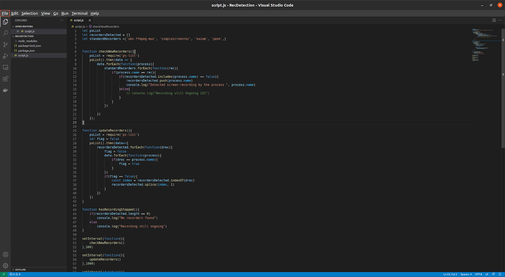

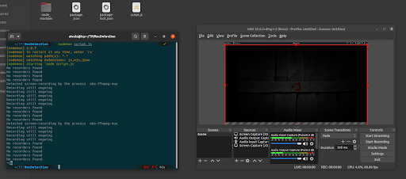

Two lists are maintained **standardRecorders** , that contains the names of processes that execute when recorders start their recording and **recordersDetected** , that contains all the recorders that are currently active (this list is required, such that repeated detection of same recorders doesn&#39;t notify repeatedly). The **checkNewRecorders()** function checks for new screen recorders. It first scans all the system processes using **ps-list** and checks whether they belong to the list of _standardRecorders_ and if found, it checks for them in _recordersDetected_ list. In case a new recorder is found, it logs &quot;Detected screen recording&quot; (for now, later we will make an api request to the backend during integration of the script) . The **updateRecorders()** function, checks if a recorder that was already recording has now stopped doing the same or not and updates the _recordersDetected_ list accordingly. It logs &quot;Recording still ongoing&quot; when the processes detected earlier are still present. Lastly, the **hasRecordingStopped()** function is used to check if no recorders are found in the processes of the user or not and logs &quot;No recorders found&quot; for the same. In this manner, we were able to completely detect the starting of recording, recording done using multiple screen recorders and the end of recording as well. After completely testing the successful run of our software, it was integrated into the application.

### Integrating the recording detection software into our app

The recording detection software needed some changes such as instead of logging the notification of recordings, the user had to be notified somehow. We decided to mark the attendees as red, whenever someone started recording and unmark them as their recording stopped. We also put the recording notification as a message in the chat-box of our app, giving a user-recording-start notification and a user-recording-stop notification.

So, our script needs to communicate with the frontend somehow to achieve the same. This isn&#39;t possible directly as only frontend-to-frontend communication in a single system can&#39;t notify all the users attending a meeting. Thus, we needed to make a request to the backend and then communicate with all the users&#39; frontend from there. Thus, an api call was made to the backend at the starting and stopping of recording by any user. The backend then notified the frontend using web-sockets (Django Channels) and thus, the recording detection data could be broadcasted to all the users attending the meeting and the same could then be used to mark the card of an attendee as red or not and provide a notification in the chat as-well.

The message sent to the backend has details about the user and the meeting. These all details were obtained from the session cookies set in the electron app. Using these cookies the data for the message was set. The message is set using WebSockets that were set up for chat.

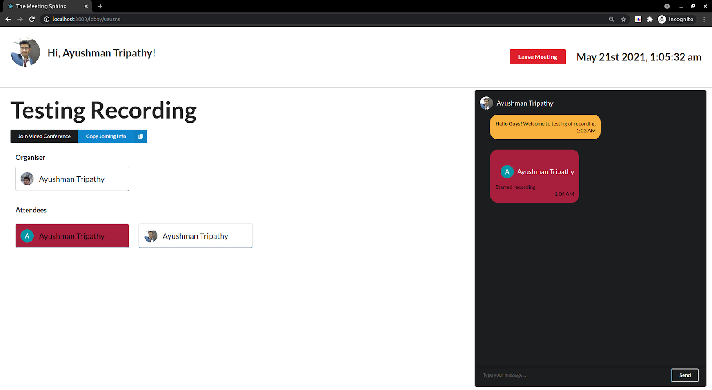
_Here as you can see that the user that started the recording has been marked as red and a chat message regarding the notification has also shown up._

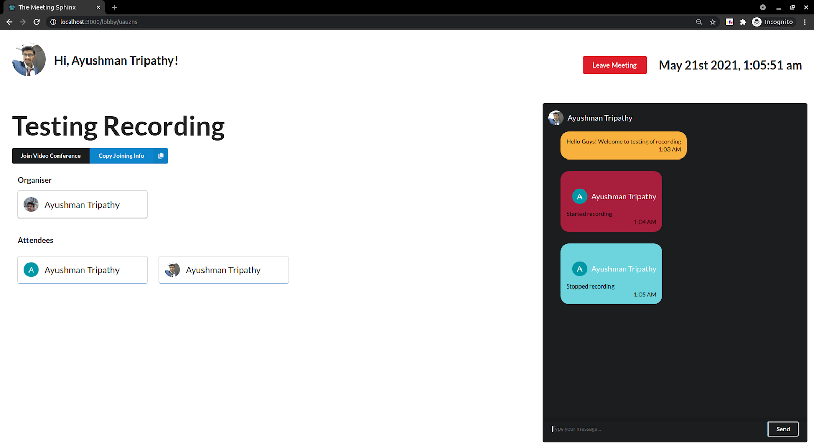
_As the recording stopped, the user was unmarked and the chat notification regarding stopping of recording was sent as well._

### What if the user has already started recording before joining any meeting?

This was a major hurdle that we needed to overcome. The user won&#39;t be present in any meeting and the cookies would have created a problem in the data sent to the backend as their default values won&#39;t be properly set.

To tackle this, we decided to put the user in a dummy meeting whenever he/she joins the meeting. This meeting has a unique code that the cookies would be set to and thus the user-data would be sent to the backend along with the meeting code of the dummy meeting. Now the backend stores the recording details whenever the user starts and stops recording and a flag is set when the user is still recording. If this flag is set while the user joins a new meeting (determined by the meeting code changing from the default meeting code of dummy meeting), then the meeting users are notified of the recording being done by this user and he/she is marked red as well.

Thus our recording detection software along with our app takes care of detecting the recording being done by any user and in all the use-cases possible,with the only requirement being the user using our app. All the possible use-cases were verified and thoroughly tested for bugs and any errors that could arise, and our app passed them all.

The development of our recording detection software was done in a highly modular manner with the least amount of coupling between the modules. Also, as you can see that the development has been done in an incremental manner in complete accordance with the principles of **Spiral Model** for software development. We also followed some of the principles of Pair Programming like code review for better testing of our code and also taking care of the probable problems that could have arisen otherwise.

## Authentication

Until now, we discussed how we detected recording on an attendee&#39;s device. In order to tell the organiser of the meeting who started recording, the recorder must be associated with a user account in our app. To minimise the complexity and increase security of our system, we relied on Google for user authentication.

### Previous Meetings

OAuth is a widely followed process for authentication through third party software. Since we want to lessen the burden of managing secure authentication, we out-source it to software that already has secure authentication implemented.

### What the user sees

To login to our app, the user:

- Clicks on a `Login with Google` button which redirects it to a google log in page.
- There he logs in to a new account or selects an already active google account.
- The user grants our app (The Meeting Sphinx) permissions to use user data stored by Google.
- The scope of user data that we get consists of:
  - Profile picture
  - Full name
  - Email Address
- The user is then redirected back to our app, where he will see our home page (With the user logged in).

### Behind the scenes

During the development of our application, we have registered The Meeting Sphinx on the Google APIs and Services Credential Console. Google generates two codes:

- `CLIENT_ID `
- `CLIENT_SECRET`

Now, for how our app handles authentication:

The first page that the user is redirected to after opening our app is the login page, where he sees a &#39;Login with Google&#39; button.

Clicking the button redirects the user to a Google authentication page, along with the following as URL parameters:

- `response_type` - The type of response we want if user allows access
- `client_id` (one of the codes generated by google when we registered our app)
- `scope` - A list of user information that we require
- `redirect_uri` - The URI to which the user will be redirected after he/she logs in through google.
- `state` - (any string)

Google identifies our app with the client\_id and asks the user to grant permission to our app to use their user data.

Once the user allows, the user is redirected to a `redirect_url` set by us in the Google API Console. Along with the URL, Google passes two parameters of importance:

- `state` - The same string we sent in our request. We must match them to confirm that they are indeed the same.
- `code` - A code to indicate that the user has successfully logged in and allowed our app to use the data.

This `code` is sent to an endpoint on our backend. The backend makes a `POST` request to another google authentication with the following request data:

- `code` - The code we received from the frontend
- `CLIENT_ID`
- `CLIENT_SECRET`
- `redirect_url` - The same redirect URL we sent above
- `grant_type` - A string with the value `&#39;authorization_code&#39;`

The code must be sent to Google from our backend within 60 seconds, after which it expires.

Google validates all the information sent by us. In response, we get a base64 encrypted JWT token. We decode the token to get the requested user data.

This ends our interaction with Google API. Our app searches for a user that matches the obtained user data. If we find the match, we directly log the user in. Otherwise, we create a new instance of a user, and log that in. In the previous statement, the term `&#39;login&#39;` means to generate a unique and random session\_id cookie and map it to a user session.

- The `session_id` cookie is sent back with the user request and stored on his/her browser. The session\_id is sent back with every following request so the server can identify the logged-in user.
- Going forwards, before showing the login page, the frontend sends a dummy request to the backend at a verification endpoint. This endpoint checks for a valid session\_id cookie, and if it maps with an active user session. If no such user session is found, then the user is redirected to the login page. However if a valid session is found, then the user is directly shown the home page.

## Create a Meeting

To create a meeting, the user clicks on the &#39;Create Meeting&#39; button, he is prompted with a dialogue box. The user must first enter the title of the meeting. If the user wants to hold the video conference in our app, then he must click &#39;Generate Sphinx Video Conference Link&#39;.

If they wish to hold their video conference on a third party application, they enter the link to that conference in the box below.

After that they click create the meeting.

### How meeting creation is handled by our app

First off, we must be able to tell the meetings whose video conference will be held on our app apart from the meetings whose conference will be held on a different app. If the creator chooses to enter a meeting link by himself, then we simply store that link. However, if the user chooses to hold the video conference on our app, then we store a dummy value as the meeting link. Since this is not a valid URL, we will not face any clashes in the custom meeting links entered by the users.

To distinguish between the third-party conference meeting\_links and our meetings, we simply check to see if the meeting\_link is our set dummy value or not.

To create and store the meeting in our database, we send a `POST` request to an endpoint on our backend with the following request data:

{

title,

meeting\_link

}

A unique meeting code is generated. A new meeting instance is created with the mentioned title, meeting\_link and meeting\_code. The creator of the meeting is added as the organiser of the meeting. The new meeting is stored in the database, and the meeting\_code is sent as a response on successful meeting creation.

The creator is then redirected to the lobby page for the meeting where he can wait for the attendees to join.

## Join a Meeting

To join a meeting, the user clicks on the &#39;Join a Meeting&#39; button on the home page, and enters the corresponding meeting\_code. If the meeting code is valid, the user joins the meeting.

### How is this handled on our backend?

The meeting code is sent to the backend. It searches for a meeting instance with the corresponding meeting\_code. If a valid meeting is found then the user is added to the list of attendees of the meeting, and a success response is sent to the backend. If a meeting is not found, then a BAD REQUEST response it sent.

Once the user receives a success response, he is also redirected to the lobby page.

When any user (attendee or organiser) joins the meeting lobby page, a websocket connection is formed with the backend. This websocket connection adds the user to a channel consisting of all the other meeting participants. A blast message is sent to all users in the channel informing them about the user join.

The joined user gets an initial message with all the meeting details:

- List of Organisers

- List of Attendees

- Meeting Title

- Meeting Code

- Meeting Link

This information is used to initialise the meeting on the frontend.

## Ban User

Only the organiser of a meeting has the permission to ban or remove a user form the meeting. The user that the organiser bans receives a message through the websocket that he has been banned. He is then redirected to the home page.

## App Dashboard

Users will also be provided a &#39;Dashboard&#39; option on the home page which include details of meetings he is currently in and also previous meetings he attended.

Keeping in mind that the primary use of our app is to hold lectures etc. for online classes, we tried to include some of the key features like listing the attendance in every meeting, listing the attendees who have recorded the meeting.

Also every user can join or create multiple meetings at the same time. So the user will also be provided with a list of meetings he/she is currently present in.

Everytime the dashboard is called, it requests the backend the Meeting details of that user from the url **apiGetMyMeetings( )**,where the list of details of past meetings and current meetings is stored. This contains the information **past\_meetings** , **ongoing\_meetings**.

### Previous Meetings

In the dashboard section of home, the user is displayed with a set of Meetings he is currently present in and also the list of meetings he has previously attended or organised.

From the information **past\_meetings** , for each meeting, we obtain the title and id of the meeting.

Now, the title of the meeting along with the option &#39;SeeDetails&#39; is provided to the user.

When the user clicks on the &#39;SeeDetails&#39; button of a specific meeting, the details of that meeting is obtained from the url**apiMeetingDetails( )** by the given id of the meeting.

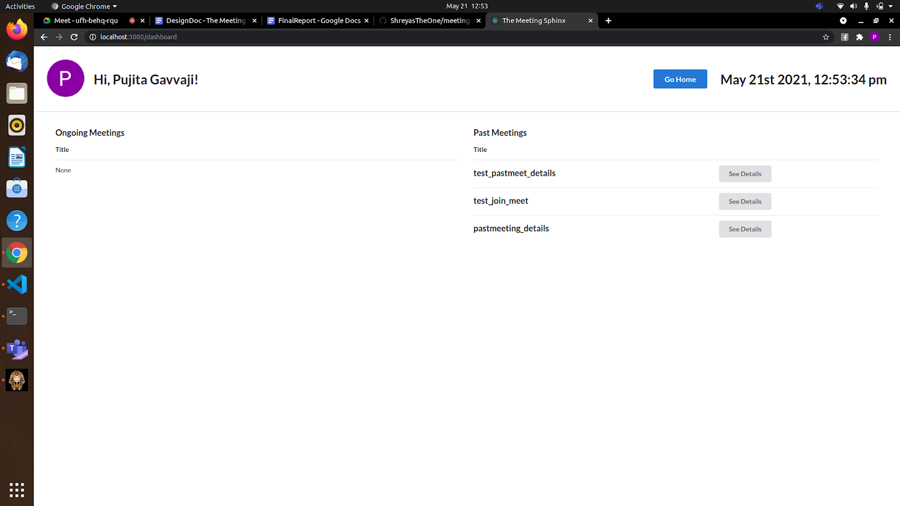

Now we receive the details, title, organisers, attendees, start\_time and end\_time of the meet, recordings, meeting\_id and render it to the See Details page. The attendance and recorded details can be obtained from here.

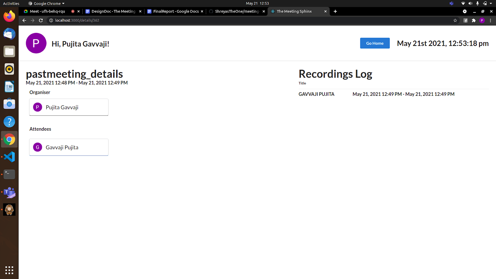

As you can see the meeting logs can be found with recording details too.

We also ensured that the Recordings log is visible only to the organisers and not to the attendees.

### Current Meetings

From the information **ongoing\_meetings** , for each meeting, we obtain the title and **meeting\_code** of the meeting.

Now, the title of the meeting along with the option &#39;Join&#39; is provided to the user.

When the user clicks on the &#39;Join&#39; button of a specific meeting, the user is redirected to the lobby of that specific meeting using the obtained meeting code. We have also ensured that users can always redirect back to the home from any of these pages.

**Chat in Lobby**

A **Chat** component is created for the frontend implementation of Chat.

This component is rendered in the lobby with following data:

{

meetingCode

user

}

In this component a websocket connection named **chatWebSocket** is initiated so that we can get to know which user is entering or exiting the meeting.

At the backend in the Chat consumer a function **connect()** is there which accepts or closes this websocket connection based on some logic like if the user is not in the members of the meeting then close this socket otherwise accept it. After accepting the connection we decided to show all the messages that were sent in that meeting even prior to this user joining. For this from all the objects of the **Message** model, messages of this particular meeting are filtered out. These filtered messages are then sorted by the **sent\_time**. These messages are then serialized and are sent to the frontend with a control type which initializes the chat with all the messages sent prior to this user joining.

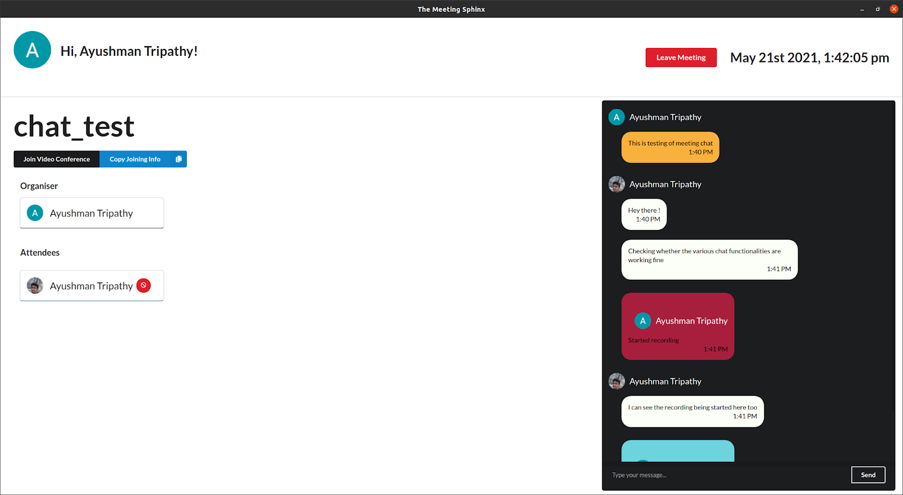

The user chat messages and recording notifications can be found in the chat component

One more thing that is checked just after accepting the connection is if this user had turned Recording on before entering the meeting, if so then a message is from backend to the frontend with a control signal that tells that this message is regarding recording being started with the user that just joined.

If this user wants to send a message then he/she can type in the input-box and then press the send button, by clicking at the send button **sendMessage()** function is called and it checks if the message is empty then it returns otherwise this message is converted into JSON string and is sent to the websocket server where the **receive()** function listens to this request and save this message and then broadcast it to the all the people joined in that meeting. Our Chat also shows up messages if some of the attendees start or stop the recording as explained in the[**Recording Detection**](#_sx2qxd95crl2) **.**

**Reducers** help in the state management and thus are used in implementing chat so that all the states corresponding to Chat are stored at one place only and according to the control signals these states are changed.

#### What if the user is not in the meeting but still trying to make a connection?

When this socket is initialized it checks in the **connect()** at the backend if the user is in **banned\_users** if it is so then it closes the connection. If the user is not found in the list of Attendees or the Organizers of the Meeting then also the web socket connection is closed.

## Video Conference

When the meeting component is created, it is initialised with the following values in the constructor:

States {

users[]: list that contains all other users in the meeting

}

Data {

myStream: contains this user&#39;s stream

primaryVideoRef: React reference to the Main video

myVideoRef: React reference to user&#39;s video

}

Initially when this component is rendered then a WebSocket **videoCallWebsocket** is initiated with the backend. At the backend, a **connect()** method is there which either accepts this connection or closes it based on some condition like if the user is not in Meeting&#39;s attendees or in Meeting&#39;s organizers then this connection is closed. Also if the user is on the banned\_user list then also this connection is closed. Otherwise, this connection is Accepted.

Messages are sent from the backend to the frontend with the following type and corresponding to each type frontend performs a particular function as mentioned below:

{

all\_users: **setUsers()**

user\_left: **handleUserLeft()**

}

Now, the first thing is to send this meeting&#39;s information to this joined user including a list of all user&#39;s user\_id **users** which is done by sending a list of users with the type all\_users. Seeing this response from the backend, function **setUsers()** is called in which first the list **users** is changed by filtering about the current user. Now a check is made if this current user is an organizer or not.

If the current user is the organizer then:

- get this user&#39;s video and audio by using **navigator.mediaDevices.getUserMedia()** with larger size that fits the big screen
- make this user&#39;s myStream as this stream
- since this is the organizer then the primary Video for this organizer will be his/her video only, so set the primaryVideoRef as this stream only

If the current user isn&#39;t an organizer then:

- get this user&#39;s video and audio by using **navigator.mediaDevices.getUserMedia()** with smaller size
- if the user&#39;s video isn&#39;t ON take him back home
- set user&#39;s myVideoRef as this stream
- again get this user&#39;s media by using **navigator.mediaDevices.getUserMedia()** which will be shown to the organizer&#39;s and other attendee when they&#39;ll open the icon **See Other Attendees**

Regardless of the fact that the user is an organizer or not, the next step is to make Peer connection with every other user.

### How the RTCPeerConnection is established

An RTCPeerConnection (aka Peer Connection) is the connection between two users who want to send video/audio/data streams to each other. Peer connections are binary in nature, in the sense that a connection can be established between two people only. Hence, if we need to connect to all the other users in the video call, then we must make a peer connection with every other user in the meeting. This means that if there are n uses in the meeting, then we must make n\*(n+1)/2 connections.

As stated above, when a user joins the meeting, he gets a list of IDs of all the users in the meeting. It is his responsibility to connect to every other user in the meeting. Below is a simplified explanation of how a peer connection is established.

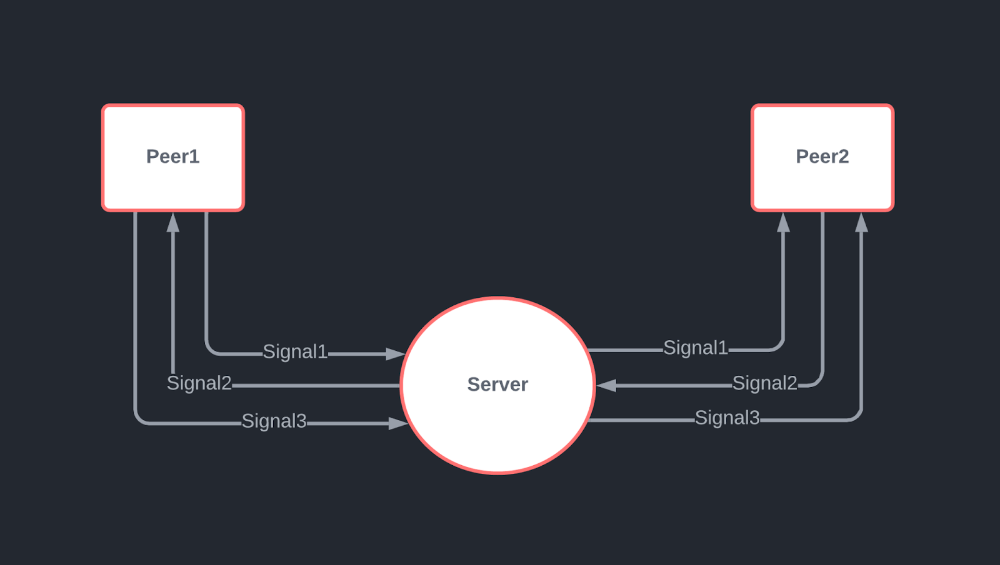

The following steps are taken to initiate a peer connection between two users:

1. Suppose USER\_1 attempts to create an RTCPeerConnection with USER\_2. USER\_1 first creates a Peer object, by passing his video and audio stream and setting himself as the initiator. Call this peer object peer1.
  1. Upon creating the peer object, a signal is sent out.
2. Using our WebSocket connection with the backend, we notify USER\_2 that USER\_1 is trying to connect to USER\_2 through an RTCPeerConnection.
3. In response, the USER\_2 creates a peer object too. Call this peer object peer2. In this case, it initialises it with its own stream of audio and video and sets the initiator to false (as this is the accepting peer). After creating the accepting peer, another signal is sent back to the first peer object.
4. One final signal is sent from peer1 to peer2 to indicate that the signal has been received.
5. Now that the connection is established, the peers can share video and audio streams among each other.
6. Each of the peers have event listeners on receiving streams. This stream is handled by our code. It channels the stream into the video elements on our device.

## Design Diagrams:

## UseCase Diagram:

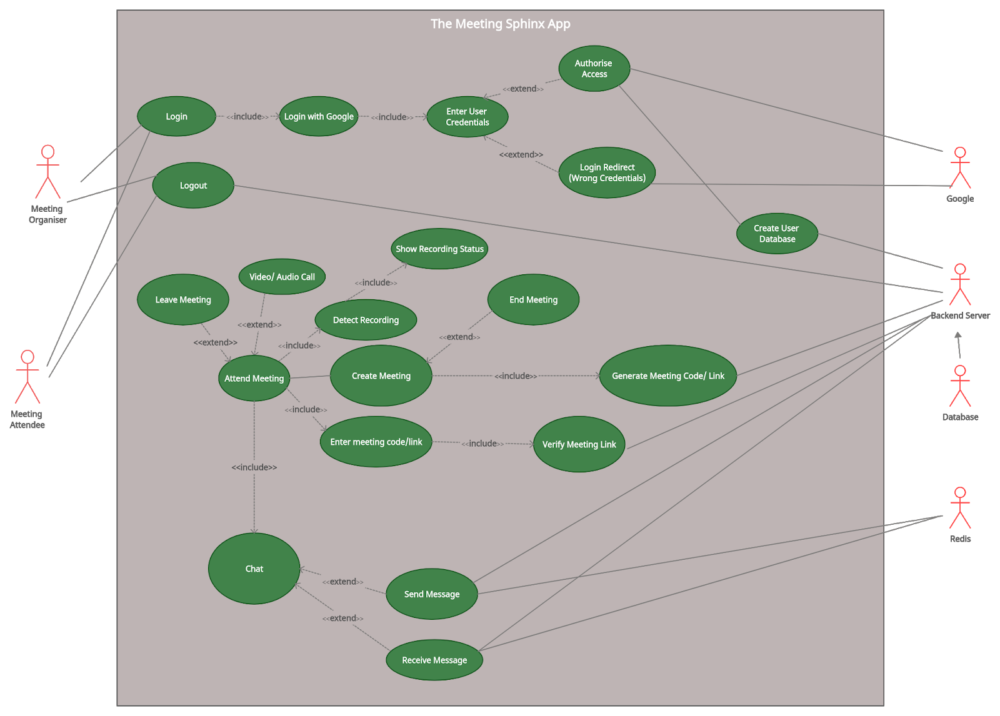

## Class Diagram of Backend :

**Class Diagram of Frontend:**

## 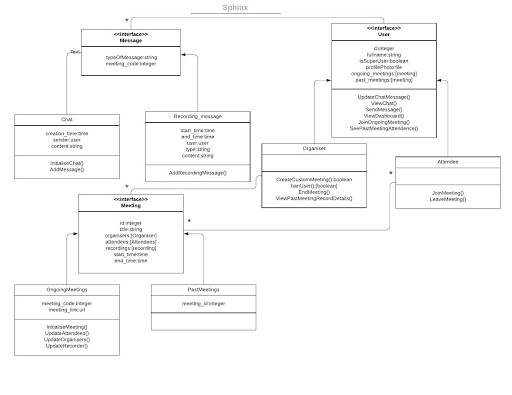

## Flow Chart of The Meeting Sphinx:

## 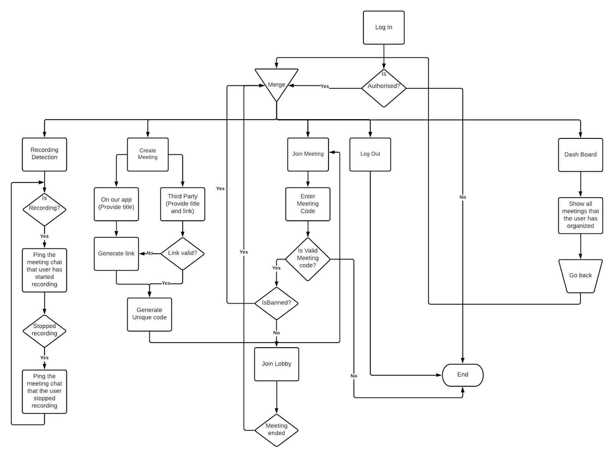 
## Backend

Our backend is based on a python framework, Django. Django is a robust tool which simplifies most of the tasks involved in creating a fully functional and easily shippable backend. The Django ORM serves as an excellent mapping between the database and the python class system, thus, making it very easy to implement object oriented concepts in relational databases. Also, we use postgreSQL as our database server as it provides excellent features for deployment and is robust enough to sustain the sheer volume of requests generated by the Django ORM. Core django is based on MVT architecture.

## MVT Architecture

MVT stands for Model-View-Template architecture. Here, models serve as an interface between the core django framework and the database querying system. We apply migrations to mirror our models (written in python) to the actual SQL schema that would be used in our database for making relations and attributes. Views serve as a logical abstraction in the MVT architecture. This is where all the requests are handled and all the logic for processing those requests are written. Next, we have templates. The templates are used to provide a user-friendly interface to the overall backend system. The core Django architecture, we use templates to serve frontend resources and views to serve backend resources on one and the same server. There are certain disadvantages to this approach. Here, the frontend and backend don&#39;t really have their individual identity and make up a generic &#39;web server&#39;. If any device wants to connect to our backend, it has to go through the UI and cannot access the resources from the database server optimally. Here comes the REST API or the RESTful API.

## Models

- **User** - This model implements our actual user and stores his / her data. Various attributes of the user model are as follows
  - username - This is the username that we get from Google after the user gives access to his/her information to us via OAuth.
  - profile\_picture - This field stores the url to the user&#39;s profile picture stored in Google&#39;s database. This is again, acquired after the user grants his / her permission via OAuth.
- **Meeting** - This model represents a meeting instance in our database. Various fields of the meeting model are as follows-
  - title - Title field stores the title of the meeting specified at the start of the meeting by the organizer.
  - rganizers - This is a many to many field to the user model. This field contains all the organizers of the meeting as a relation in the database.
  - banned - This field is also a many to many field to the user model and contains relations corresponding to those users who were recording that particular meeting.
  - start\_time - A datetime field specifying the start of the meeting. It is automatically set to the time at which the meeting was created.
  - end\_time - A datetime field which stores the time at which the meeting ended.
  - meeting\_code - A field that stores the unique 6 digit code to a meeting.
  - meeting\_link - A field that stores the link to the meeting.
- **Attendee** - A model that represents an attendee instance in a meeting. The fields are as follows:
  - user - Foreign key to the user model denoting the person who is the attendee.
  - meeting - Foreign key to the meeting instance that the user is attending.
  - start\_time - A datetime field denoting the time at which the user joined the meeting.
  - end\_time - A datetime field denoting the time at which the user left the meeting.
- **Recording** - A model that stores the instances corresponding to the recording attempts made by the user. The fields are as follows:
  - user - Foreign key to the user model representing the user that was attempting to record.
  - meeting - Foreign key to the meeting model in which recording was performed.
  - start\_time - A datetime field representing the time at which the recording started. This field is set automatically.
  - end\_time - A datetime field representing the time at which the recording ended.
- **Message** - This model stores the messages that are sent in the meetings to preserve messages even after the meeting ends. The fields of this model are as follows:
  - meeting - Foreign key to the meeting model which represents the meeting in which the message was passed.
  - sender - Foreign key to the user that sent the message.
  - content - The content of the message.
  - creation\_time - The time at which the message was sent. This field is set automatically.

## REST and Django REST Framework

REST stands for Representational State Transfer. It is a set of well defined rules and protocols that an API must follow in order to make the conversation between the clients and the API easy and optimal. REST APIs give us immense flexibility as they can be used to make a generic interface on which the frontend services can request for all kinds of services. From frontend servers to IoT devices, anyone can connect to a single backend server by following the guidelines provided by the REST API. We use Django REST Framework, abbreviated as DRF to make our backend RESTful. We have used 2 main functionalities of the DRF namely serializers and viewsets. Serializers are utility classes that serve as parsers. Any data, in the form of a request is passed through serializers to convert it into Django Model Objects. Serializers also perform the crucial task of validating data. They are also used to convert the information stored in Django Models to transportable formats like JSON objects. Viewsets are the logical abstraction layer of the DRF. They provide the actual rest interface and perform the task of calling various models, serializers and methods to receive and send data. They have special permissions from individual objects and are very flexible.

## Dockerization and Production Rules

We have used docker for containerizing our backend. Keeping in mind, various concepts of Software Engineering, containerizing our app was one of the most optimal choices. Our app, being containerized, is highly agile i.e. the time period between our developing the app and consumers receiving and deploying it is minimal. Moreover, using and setting up our app has become easy. It takes only one command to set the project up and get it going. Also, docker containers provide us with a consistent and isolated environment so that we have complete control over all the factors of the backend. Deploying multiple services have led us to isolate various parts of our backend and has made the server hub more granular. Docker containers provide us with excellent cost effectiveness with fast deployment and vents us through the tedious task of actually setting up hardware manually. Docker containers are extraordinarily mobile. They can be run anywhere. From a raspberry pi to kubernetes clusters, our server can run on any and every device that can run _containerd_, the container daemon. In the case that our project scales up, we can easily scale our resources up due to docker containers. Workflows such as CI/CD - Continuous Integration and Continuous Delivery can be achieved with the help of docker containers. Due to so many advantages, we have dockerized our app. Our app has a complex structure consisting of multiple services and workers. All these are dockerized and are maintained using a tool called **docker-compose**. **docker-compose** takes configurations related to the structure of our network and handles the rest by itself. Our backend consists of the following services:

- **db** -
  - This is our database service. Built on the latest docker image of postgres, this service serves as a storehouse for all the information.
  - The information is preserved even if the container is destroyed by using docker bind mount which mounts directly on the database directory of the host machine.
- **redis** -
  - This is our caching server which is used in the channel layers to store the messages temporarily.
  - It is built on the latest docker image of redis.
- **web -**
  - This service has the actual backend which houses the actual web server with its dependencies.
  - It is built on the latest image of python (alpine). Using the alpine version makes the size of service less and minimal.
  - We have used production grade servers here and at the same time, provided functionality to the developers to refine and maintain code.
  - Server structure:
    - **gunicorn** - We have used gunicorn, the state of the art WSGI server as our Web Server Gateway Interface in production.
    - **daphne** - We have used daphne, the state of the art ASGI server as our Asynchronous Server Gateway Interface in production.
    - **supervisord** - We have used supervisord to monitor and run all the servers involved. It logs the outputs of all the servers mentioned in log files and restarts a server in the case any server shuts down. It logs vital information like the uptime, the resources used, etc. of itself as well as all the servers in this service.
- **reverse-proxy** -
  - We have used nginx as our reverse proxy server in production. It optimizes the requests and forwards the requests to the WSGI and ASGI servers at their respective ports. It serves all the static files via a shared volume with the web service.
  - Note that we use the reverse proxy in production only as the python development server makes its need obsolete.

Continuing with the docker-compose configurations, we have 2 configurations for 2 modes: Development and Production. The configurations are explained below

- This configuration spins up 3 services namely db, redis and web. They are explained above.
- For the service _db_ running inside the container _sphinx\_postgres_, we expose port 5432 on the docker internal network named _sphinx\_network_. We change the default user to _postgres_ so that we can access all the database functions without restrictions and mount a named volume _database_ targeted towards the native postgres datastore.
- We expose the port 6379 on the network _sphinx\_network_ for the redis service and login as user _redis_. This service runs inside a container named _sphinx\_redis_.
- We run the web service inside the container _sphinx\_web_. The development and production configurations are different for this service.
  - Development -
    - In the development environment, we use the development server provided by django channels itself. This server provides excellent tools for development like auto-reload, direct serving of static files, useful debug information, etc.
    - Here, we expose the port 8000 to _sphinx\_network_ and forward it to the port 54321 outside the network so that we can access it from the outside.
    - We make a volume for our code directory so that we can see the development server react instantly to our code changes.
  - Production -
    - Here, we cannot use the native django channels development server. We use different production grade servers and run them by using supervisord.
    - We expose the ports 8000 and 8001 to _sphinx\_network_ corresponding to gunicorn and daphne respectively.
    - We also make volumes for static files and media files so that they can be served on the reverse-proxy server. There is a volume for code too. But using this to edit code is highly depreciated in production.
    - We have a bind mount for the supervisord log files so that they can be preserved even if the container stops.
- Lastly, for the production configuration, we have the reverse-proxy service which runs inside the container _sphinx\_reverse\_proxy_.
- It exposes port 80 to the _sphinx\_network_ and the port is forwarded to the external port 54321 so that it can be accessible from outside.
- It mounts the volumes corresponding to the static files and media files and serves these files directly. It has a volume corresponding to the nginx configuration files which contain important information on how and where the requests should be forwarded. There are protocols for compression, headers and request upgradation from Hypertext Transfer Protocol to Websockets.

## Packaging our app

As we are making a linux native application thus, packaging the application was very important. We packaged the app into a debian and snap package using the npm package [**electron-builder**](https://www.electron.build/). Now our app can run independently on any system by simply clicking its icon (as the backend is deployed on a universally accessible platform).

We had to restructure the dependencies for packaging our app. Initially we had two package-managers that might have caused problems, so we rebuilt the _package.json_ from scratch with just the required dependencies using only **npm** as the package-manager. Then the license, author, contributors, version and app description were specified. After this, the build scripts were written, so that _electron-builder_ could be used. These scripts needed the specifications of our package like the build resources and app targets (like linux:_deb_, linux:_snap_, etc). Finally we made some modifications to _electron.js_ file in the public directory (the one that is used for integration of electron into react) so that the dev and production versions could be distinguished and separate urls could be used for our app to work (in dev version, the app runs on [http://localhost:3000/](http://localhost:3000/) which electron loads into its window, which is not the case in the production version, where the app runs on electron-browser window thus the url becomes &quot;./&quot;). Now, our app finally became ready to be packaged into a release version.

We wrote two scripts that build our app and then finally package it into a distribution like (.deb, .rpm or a snap). To make a release version of our app, one has to just run two commands one after another--

- npm run **preelectron-pack**
- npm run **dist:linux**

After these commands a dist folder would be created with our app packaged into various types.

With our app being able to be packaged it increases its usability by manyfolds as the user just has to run the package like any other desktop application and it thus becomes user-friendly.

## Applications of Software:

This application has this distinguishing feature that makes it stand out from other available meeting applications in the market. So, this software is the best and the only available choice for the people who want to organize secure and confidential meetings.

As this global pandemic right now doesn&#39;t allow us to have offline teachings, this software can be used by schools to organize online classes so that the teacher can get to know if any student is recording the lecture or not.

Also, our software doesn&#39;t bind the user to switch completely to a new platform from a traditional one with which he may be much more comfortable. Such users can use this software as a third party app and can continue their teaching without worrying about the students recording the lecture.

Apart from hosting meetings and lectures, this software can be used as a live-streaming platform. We have encountered many incidents where the viewers record the Live-Streaming videos which are paid and then sell this recorded pirated video. To control this, our app can be modified a bit at the UI to render live-streaming videos, but the algorithm for recording detection remains the same and can enforce a better and secure hosting environment.

## Innovation of Software:

Recording Detection is a new concept in its entirety and there exists no such app till date that detects recordings done by its users. Thus, here lies the uniqueness of our app, with it being able to achieve a completely new feature.

A huge number of hurdles were to be overcome in order to design the software and since there were no proper references while making the app, we had to come up with completely new and feasible designs for our app to meet its purpose.

Firstly, there was no way a browser could detect the processes running in one&#39;s system, thus we had to make the app in an environment that supported the listing of system processes such that recorder processes could be detected. Thus, we decided to overcome this hurdle by using electron and then using the npm package **ps-list**. Now the recorders, if found in a user&#39;s system, could be detected easily.

The next major target was the designing of the recording detection software which has been described above in detail in the implementation section of the recording detection. This had given rise to many other major hurdles like the browser cookies not being properly set, thus creating problems in making requests to the backend while notifying the recording detection and stopping. This was resolved by using browser cookies to let the backend know the meeting in which the user is present and thus properly connecting to the socket of the meeting. After the establishment of socket connections, the notification was handled properly now.

The final major obstacle to developing the recording software was detecting if the user has already started recording before even joining any meeting. This was resolved by using a dummy meeting and presetting the cookies to some predefined default values. Then the user could easily make requests to the backend to set a flag, thus knowing at the start of the meeting about the user recording detection by checking this flag at the backend. The communication of the same could be easily done using the predefined web-sockets that are setup for the meeting.

Many other innovative techniques were used to fix bugs and other issues that arose and finally our software could be made bug-free and elegant.

## **References of datasets or resources**

We researched the various screen recording softwares available in Linux and studied the processes that run in the background when they are active. Other than this, the whole app was made from scratch and hasn&#39;t ever been implemented. We had to refer to the documentation of azure cloud services for deploying our backend.
